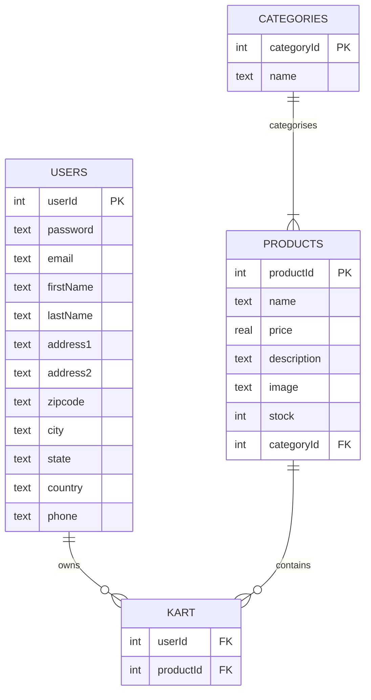

# Shopping Cart — Engineering Doc  

---  

## System overview  
The Shopping Cart system is a Flask‑based e‑commerce web application that lets visitors browse a catalog of products, view product details, add items to a shopping cart, and place orders (the order‑placement step is not implemented in the current code). It serves **customers** (any visitor who registers or logs in) and **administrators** (who can add or remove products via the `/add`, `/addItem`, `/remove`, and `/removeItem` endpoints).  

---  

## Tech stack  

| Layer | Technology |
|-------|------------|
| Language | Python |
| Web framework | Flask |
| Templating | Jinja2 (via `render_template`) |
| Database | SQLite (`sqlite3` module) |
| Utilities | `hashlib` (MD5), `werkzeug.utils.secure_filename`, OS file handling |
| Front‑end assets | HTML/CSS/JS served from `templates/` and `static/` (uploads stored in `static/uploads`) |

---  

## Ingress  

All inbound HTTP endpoints are defined in **`main.py`**. The table lists the route, HTTP method, request payload, and authentication requirement. The **`path:line`** column points to the line where the route decorator is declared.

| Route | Method(s) | Request data (form/query) | Auth required? | Source |
|-------|-----------|---------------------------|----------------|--------|
| `/` | GET | – | No (public home page) | `main.py:27` |
| `/add` | GET | – | **No** – admin UI is exposed without auth | `main.py:38` |
| `/addItem` | POST | `name`, `price`, `description`, `stock`, `category`, `image`, `passportNo`, `creditCardNo`, `bankAccountNumber` | **No** – anyone can post a product | `main.py:44` |
| `/remove` | GET | – | **No** – product list for removal is public | `main.py:66` |
| `/removeItem` | GET | query `productId` | **No** – deletion is unauthenticated | `main.py:73` |
| `/displayCategory` | GET | query `categoryId` | Session (`email` in Flask `session`) | `main.py:81` |
| `/account/profile` | GET | – | Session (`email`) | `main.py:97` |
| `/account/profile/edit` | GET | – | Session (`email`) | `main.py:108` |
| `/account/profile/changePassword` | GET, POST | `oldpassword`, `newpassword` (POST) | Session (`email`) | `main.py:124` |
| `/updateProfile` | POST | `email`, `firstName`, `lastName`, `address1`, `address2`, `zipcode`, `city`, `state`, `country`, `phone` | Session (`email`) | `main.py:155` |
| `/loginForm` | GET | – | No (login page) | `main.py:170` |
| `/login` | POST, GET | `email`, `password` (POST) | No (credentials supplied) | `main.py:176` |
| `/productDescription` | GET | query `productId` | Session (`email`) – used for UI elements only | `main.py:197` |
| `/addToCart` | GET | query `productId` | Session (`email`) | `main.py:207` |
| `/cart` | GET | – | Session (`email`) | `main.py:224` |
| `/removeFromCart` | GET | query `productId` | Session (`email`) | `main.py:242` |
| `/logout` | GET | – | Session (`email`) – clears it | `main.py:259` |
| `/register` | POST, GET | `password`, `email`, `firstName`, `lastName`, `address1`, `address2`, `zipcode`, `city`, `state`, `country`, `phone` (POST) | No (public registration) | `main.py:274` |
| `/registerationForm` | GET | – | No (public) | `main.py:298` |

---  

## Egress  

The current code does **not** send data to external services or APIs. All data stays inside the Flask process and the local SQLite file.  

---  

## Internal topology  

* **Entry point** – `main.py` creates the Flask app (`app = Flask(__name__)`) and registers all routes.  
* **Routing layer** – Each `@app.route` decorator maps a URL to a view function that performs request handling, database access, and template rendering.  
* **Database access** – Every view opens a short‑lived SQLite connection (`sqlite3.connect('database.db')`) using a context manager, executes parameterised SQL, commits/rolls back, and closes the connection.  
* **Templates** – HTML pages are rendered with `render_template()` and live under the `templates/` directory (e.g., `home.html`, `add.html`).  
* **Static assets** – Uploaded product images are saved under `static/uploads/`.  

```mermaid
graph TD
    A[main.py] --> B[Flask app]
    B --> C[Routes]
    C --> D[SQLite DB (database.db)]
    C --> E[Templates (templates/)]
    C --> F[Static uploads (static/uploads/)]
    D --> G[Tables: users, products, kart, categories]
```

---  

## Data stores  

### Schema (defined in **`database.py`**)

| Table | Columns (type) | Primary Key | Foreign Keys |
|-------|----------------|-------------|--------------|
| **users** | `userId INTEGER PK`, `password TEXT`, `email TEXT`, `firstName TEXT`, `lastName TEXT`, `address1 TEXT`, `address2 TEXT`, `zipcode TEXT`, `city TEXT`, `state TEXT`, `country TEXT`, `phone TEXT` | `userId` | – |
| **products** | `productId INTEGER PK`, `name TEXT`, `price REAL`, `description TEXT`, `image TEXT`, `stock INTEGER`, `categoryId INTEGER` | `productId` | `categoryId → categories.categoryId` |
| **kart** | `userId INTEGER`, `productId INTEGER` | – (composite) | `userId → users.userId`, `productId → products.productId` |
| **categories** | `categoryId INTEGER PK`, `name TEXT` | `categoryId` | – |



### PII / Sensitive fields  

* **users** – `password`, `email`, `firstName`, `lastName`, `address1`, `address2`, `zipcode`, `city`, `state`, `country`, `phone`  
* **addItem** form (not persisted) – `passportNumber`, `creditCardNo`, `bankAccountNumber` (captured but never stored)  

---  

## Deployment & runtime  

* **Start command** – `python main.py` (executed directly).  
* **Host / Port** – Flask’s built‑in development server listens on `localhost:5000`.  
* **Debug mode** – Enabled (`app.run(debug=True)`) – provides auto‑reload and detailed error pages.  
* **Configuration** –  
  * `app.secret_key = 'random string'` (hard‑coded) – used for signed cookies / session data.  
  * `UPLOAD_FOLDER = 'static/uploads'` – directory for product images.  

---  

## Cross‑cutting concerns  

| Concern | Implementation |
|---------|----------------|
| **Session management** | Flask’s signed cookie session (`session` dict). The secret key is static and weak (`'random string'`). |
| **Authentication** | Simple email/password check in `is_valid()` (MD5 hash comparison). Successful login stores `session['email']`. |
| **Authorization** | Routes that need a logged‑in user check `if 'email' not in session`. **Admin routes (`/add`, `/addItem`, `/remove`, `/removeItem`) lack any check**, making them publicly accessible. |
| **Error handling** | Database writes wrapped in `try/except` with `conn.rollback()` on failure; errors are logged via `print(msg)` but not surfaced to the user (except for registration/login). |
| **File uploads** | `allowed_file()` validates extensions against a whitelist; filenames are sanitized with `secure_filename`. Uploaded files are saved directly under `static/uploads`. No size limits or virus scanning. |
| **Input validation** | Minimal – numeric fields are cast (`float`, `int`) but no further validation; form fields like `passportNumber` are never used. |
| **Password storage** | MD5 hash (`hashlib.md5`) – considered cryptographically broken. |
| **Logging** | Only `print()` statements for success/failure; no structured logging. |

---  

## Security concerns  

| Issue | Location | Why it matters |
|-------|----------|----------------|
| **Weak password hashing (MD5)** | `is_valid()` (`main.py:215`), registration (`main.py:284`), password change (`main.py:132`) | MD5 is fast and vulnerable to rainbow‑table attacks; passwords should be stored with a slow, salted algorithm such as bcrypt, Argon2, or PBKDF2. |
| **Hard‑coded secret key** | `app.secret_key = 'random string'` (`main.py:5`) | Predictable secret key enables attackers to forge session cookies. It should be generated securely and loaded from environment variables or a secrets manager. |
| **Unauthenticated admin endpoints** | `/add` (`main.py:38`), `/addItem` (`main.py:44`), `/remove` (`main.py:66`), `/removeItem` (`main.py:73`) | Anyone can add, modify, or delete products, leading to defacement or data loss. Proper role‑based access control is required. |
| **Plain‑text handling of sensitive financial data** | `addItem` form captures `passportNumber`, `creditCardNo`, `bankAccountNumber` (`main.py:53‑55`) but never stores them; however, they travel in clear HTTP requests. | Even transient handling can be logged or intercepted; such data should be transmitted over HTTPS and never logged or stored unless strictly needed. |
| **SQL injection mitigation** | All queries use parameterised placeholders (`?`) – good practice. |
| **Debug mode in production** | `app.run(debug=True)` (`main.py:332`) | Exposes stack traces and internal configuration to attackers. Debug should be disabled in production. |
| **No CSRF protection** | Forms (`addItem`, `register`, `login`, etc.) lack CSRF tokens. | Enables cross‑site request forgery attacks. Flask‑WTF or similar middleware should be added. |
| **File upload path traversal protection** | Uses `secure_filename` – mitigates but no size checks. | Large files could exhaust disk space; additional validation is advisable. |
| **Session fixation** | Session is created on login but never regenerated; an attacker could set a session ID before login. | Regenerate the session ID after successful authentication. |

---  

## Open questions  

1. **Purpose of the extra PII fields** (`passportNumber`, `creditCardNo`, `bankAccountNumber`) collected in `/addItem`. They are never persisted or used; clarification is needed to decide whether they should be removed or stored securely.  
2. **Intended admin model** – The code hints at an admin UI but there is no role/permission system. What user roles exist, and how should they be enforced?  
3. **Order processing** – The cart can be viewed and items removed, but there is no checkout or order table. Is that out of scope or planned for a future iteration?  
4. **Deployment environment** – The current setup is a local development server. Will the app be containerised, run behind a WSGI server (Gunicorn/uwsgi), or deployed to a cloud platform?  
5. **Static asset handling** – Are there any CDN or caching requirements for product images?  

---  

*All line references (`path:line`) correspond to the version of the source files shown in the prompt.*