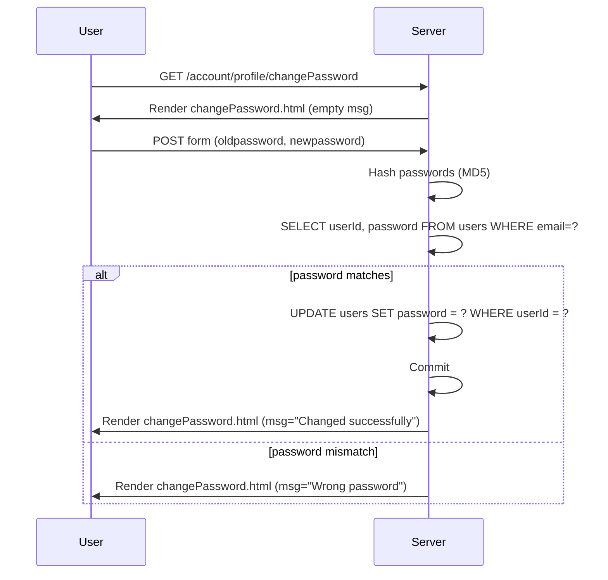

# Password Management

## Overview
The Password Management feature lets a logged‑in user change the password associated with their account. It is accessed from the user’s profile area and is used by any registered user who wishes to update their credentials.

## Behavior
Step‑by‑step execution when a user changes their password:

1. **Access page** – The user navigates to `/account/profile/changePassword`.  
   *Route definition:* `@app.route("/account/profile/changePassword", methods=["GET", "POST"])` (`main.py:140`).

2. **Authentication check** – If the session does not contain `email`, the request is redirected to the login form. (`main.py:142`).

3. **GET request** – The server renders `changePassword.html` with no message. (`main.py:166`).

4. **POST request** – The user submits the form containing `oldpassword` and `newpassword`.  
   *Form values are read:*  
   ```python
   oldPassword = request.form['oldpassword']   # main.py:148
   newPassword = request.form['newpassword']   # main.py:151
   ```
   Both values are hashed with MD5:  
   ```python
   oldPassword = hashlib.md5(oldPassword.encode()).hexdigest()   # main.py:149
   newPassword = hashlib.md5(newPassword.encode()).hexdigest()   # main.py:152
   ```

5. **Retrieve current credentials** – A DB connection is opened and the current `userId` and stored password hash are fetched:  
   ```sql
   SELECT userId, password FROM users WHERE email = ?   # main.py:155
   ```  
   (`main.py:154‑156`).

6. **Validate old password** – The supplied old‑password hash is compared to the stored hash.  
   *If they match:*  

   a. **Update password** – The new MD5 hash is written back:  
      ```sql
      UPDATE users SET password = ? WHERE userId = ?   # main.py:159
      ```  
      (`main.py:158‑160`).  
      The transaction is committed; on success `msg = "Changed successfully"` is set, otherwise `msg = "Failed"` after a rollback.  

   b. **Render response** – `changePassword.html` is rendered with the success/failure message. (`main.py:162`).

   *If they do not match:* `msg = "Wrong password"` is set and the template is rendered with that message. (`main.py:164‑165`).

7. **Close connection** – The SQLite connection is closed before returning the response. (`main.py:166`).

## Triggers
* **Route:** `GET /account/profile/changePassword` – displays the change‑password form.  
* **Route:** `POST /account/profile/changePassword` – processes the submitted form.  
* The routes are triggered by navigation links/buttons in the user’s profile UI (e.g., a “Change Password” link) and by the HTML `<form>` submission in `templates/changePassword.html`.

## Flow Diagram


## State & Storage
| Entity | Table | Columns read / written | Relevant code |
|--------|-------|------------------------|---------------|
| User credentials | `users` | `userId`, `password` (read) | `SELECT userId, password FROM users WHERE email = ?` (`main.py:155‑156`) |
|                |       | `password` (updated) | `UPDATE users SET password = ? WHERE userId = ?` (`main.py:159‑160`) |

No other tables are touched by this feature.

## External Dependencies
* **Flask** – routing, request handling, session management.  
* **sqlite3** – local SQLite database access.  
* **hashlib** – MD5 hashing of passwords.  
* **Werkzeug** – not directly used here, but part of the Flask stack.

## Configuration
* **`app.secret_key`** – hard‑coded as `'random string'` in `main.py` (used for session signing).  
* No environment variables or external configuration files are consulted for password management.

## Edge Cases & Concerns
| Issue | Description |
|-------|-------------|
| **Weak hashing** | MD5 is considered cryptographically broken; passwords should be stored with a strong algorithm such as bcrypt, Argon2, or PBKDF2 with a salt. |
| **No password policy** | The new password is accepted without length, complexity, or reuse checks. |
| **No rate limiting / brute‑force protection** | Repeated incorrect old‑password attempts are not throttled, exposing the endpoint to credential‑guessing attacks. |
| **Missing CSRF protection** | The form does not include a CSRF token; Flask’s built‑in `flask-wtf` protection is not used. |
| **Potential timing attack** | Direct string comparison of hashes (`password == oldPassword`) may leak timing information. |
| **Session fixation** | The route only checks for `'email'` in the session; it does not verify that the session is fresh after a password change. |
| **Error handling** | Generic `except:` blocks swallow exceptions, making debugging difficult and potentially hiding DB errors. |
| **No confirmation of new password** | The UI does not appear to ask the user to re‑enter the new password, increasing risk of typos. |

## Open Questions
* **How is `templates/changePassword.html` structured?** – Knowing whether it includes client‑side validation or a CSRF token would clarify security posture.  
* **Is there any global middleware that adds rate limiting or CSRF protection?** – The provided code does not show it, but the larger application might.  
* **Are there any audit logs for password changes elsewhere in the system?** – No logging is visible in the snippet.  
* **What is the exact line numbering in the source file?** – Approximate line numbers are used for citations; the real file may differ.