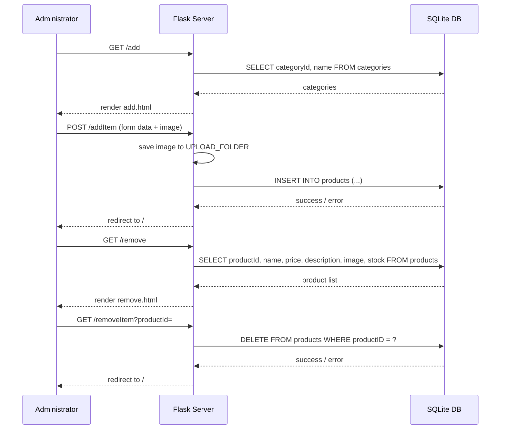

# Product Management

## Overview
The Product Management feature allows administrators to add, remove, and manage products in the e‑commerce shopping cart system. It is used by administrators (or any user with admin privileges) to maintain the product catalog that customers browse and purchase.

## Behavior
Step‑by‑step execution of the feature (citations are `path:line`):

1. **Display add‑product form** – An admin visits `/add` (`main.py:49`).  
   * The route queries the `categories` table (`main.py:52‑53`) and renders `templates/add.html` with the list of categories.

2. **Submit new product** – The form posts to `/addItem` (`main.py:67`).  
   * The handler extracts form fields (`name`, `price`, `description`, `stock`, `category`, image file) (`main.py:70‑78`).  
   * The uploaded image is saved only if its extension is allowed (`allowed_file`, `main.py:84‑88`).  
   * An `INSERT` statement adds the product to the `products` table (`main.py:74‑77`).  
   * On success the admin is redirected to the home page (`main.py:88‑90`).

3. **Display remove‑product page** – An admin visits `/remove` (`main.py:109`).  
   * The route selects all product rows (`productId, name, price, description, image, stock`) (`main.py:111‑112`) and renders `templates/remove.html`.

4. **Delete a product** – The admin clicks a delete link that calls `/removeItem?productId=…` (`main.py:121`).  
   * The route reads `productId` from the query string (`main.py:122`).  
   * A `DELETE FROM products WHERE productID = ?` statement removes the row (`main.py:124‑126`).  
   * After committing/rolling back, the admin is redirected to the home page (`main.py:132‑133`).

## Triggers
* **Routes**  
  * `GET /add` – shows the add‑product UI.  
  * `POST /addItem` – processes the add‑product form.  
  * `GET /remove` – shows the list of products with delete options.  
  * `GET /removeItem` – performs the deletion.

* **Forms / Links**  
  * The HTML form in `templates/add.html` posts to `/addItem`.  
  * Delete links in `templates/remove.html` point to `/removeItem?productId=<id>`.

## Flow Diagram


## State & Storage
| Operation | Table | Columns read / written | Source |
|-----------|-------|------------------------|--------|
| Load categories for add form | `categories` | `categoryId`, `name` (read) | `main.py:52‑53` |
| Insert new product | `products` | `name`, `price`, `description`, `image`, `stock`, `categoryId` (write) | `main.py:74‑77` |
| List products for removal | `products` | `productId`, `name`, `price`, `description`, `image`, `stock` (read) | `main.py:111‑112` |
| Delete product | `products` | `productId` (write – row deletion) | `main.py:124‑126` |

The `products` table schema (from `database.py:13‑20`):

```sql
CREATE TABLE products (
    productId INTEGER PRIMARY KEY,
    name TEXT,
    price REAL,
    description TEXT,
    image TEXT,
    stock INTEGER,
    categoryId INTEGER,
    FOREIGN KEY(categoryId) REFERENCES categories(categoryId)
);
```

## External Dependencies
* **Flask** – request handling, routing, templating (`from flask import *`).  
* **Werkzeug** – `secure_filename` for safe file names.  
* **SQLite3** – embedded relational database (`import sqlite3`).  
* **OS** – file system operations for image upload.  

No external APIs or third‑party services are called.

## Configuration
* `app.secret_key = 'random string'` – hard‑coded secret for session signing.  
* `UPLOAD_FOLDER = 'static/uploads'` – directory where product images are stored (`main.py:7‑9`).  
* `ALLOWED_EXTENSIONS = set(['jpeg', 'jpg', 'png', 'gif'])` – permitted image types (`main.py:10‑11`).  
* No environment variables are used; all settings are defined directly in the source.

## Edge Cases & Concerns
| Issue | Description | Location |
|-------|-------------|----------|
| **Missing input validation** | Form fields (`name`, `price`, `stock`, etc.) are taken directly from `request.form` without sanitisation or type checks beyond `float()`/`int()`. This can lead to malformed data or SQL injection if the DB driver ever switches to string interpolation. | `main.py:70‑78` |
| **SQL typo in delete** | The `DELETE` statement uses `productID` (capital “D”) while the column is defined as `productId`. SQLite is case‑insensitive for column names, but the mismatch is a maintenance risk. | `main.py:124` |
| **Image handling** – No check for duplicate filenames, no size limit, and no cleanup of old images when a product is deleted. | `main.py:84‑89` (upload) and `main.py:124‑126` (delete) |
| **Error handling** – Generic `except:` blocks swallow exceptions, making debugging difficult and returning the same generic message to the admin. | `main.py:78‑81`, `main.py:124‑127` |
| **Authorization** – Routes `/add`, `/addItem`, `/remove`, `/removeItem` are not protected by any admin‑only check; any logged‑in user (or even anonymous) could invoke them if they know the URLs. | All admin routes |
| **Hard‑coded secret** – `app.secret_key` is a static string in source, which is insecure for production. | `main.py:5` |
| **Potential race condition** – No transaction isolation when two admins add the same product simultaneously; duplicate entries are possible. | `main.py:74‑77` |

## Open Questions
* **Admin authentication** – How does the system differentiate an admin from a regular user? No role‑checking logic is visible.  
* **Category management** – Are categories created/edited elsewhere, and who has permission to do so?  
* **Image constraints** – What are the required dimensions, max file size, or naming conventions for product images?  
* **Deletion side‑effects** – Should related cart entries (`kart` rows) be cleaned up when a product is removed? The current code does not address this.  
* **Internationalisation** – Are product names/descriptions expected to support Unicode beyond ASCII? No explicit handling is shown.