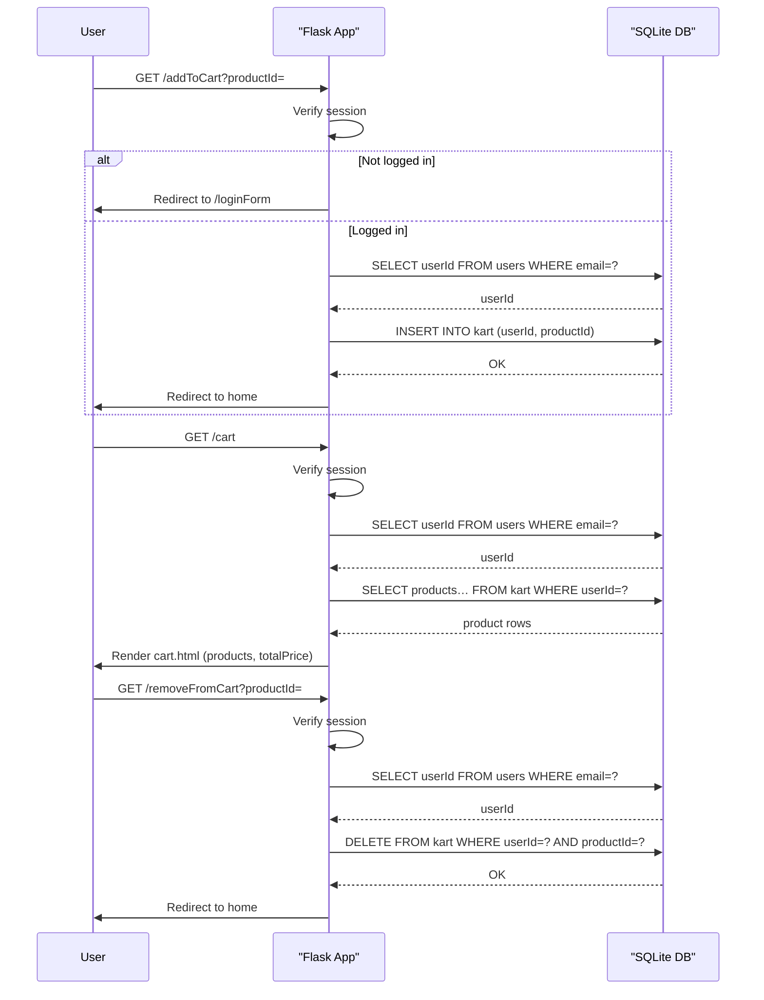

# Shopping Cart Management

## Overview
The Shopping Cart Management feature enables logged‑in customers to add products to a personal cart, view the cart’s contents, and remove items. It is used by any registered user who wishes to purchase products.

## Behavior
Step‑by‑step execution:

1. **Add to cart** – The user clicks an “Add to Cart” link that calls `/addToCart` (`main.py:87`).  
2. The route checks the session; if the user is not logged in it redirects to the login form (`main.py:88`).  
3. When logged in, the route extracts `productId` from the query string, looks up the current user’s `userId` (`main.py:91‑92`), and inserts a row into `kart` (`main.py:93‑94`).  
4. **View cart** – The user navigates to `/cart` (`main.py:136`).  
5. The route again verifies the session, then retrieves the user’s `userId` (`main.py:141‑142`).  
6. It selects all products linked to that user in `kart` (`main.py:143‑144`) and computes the total price by iterating over the result set (`main.py:145‑149`).  
7. The cart page (`templates/cart.html`) displays each product’s name, price, image, and the aggregated total.  
8. **Remove from cart** – The user clicks a “Remove” link that calls `/removeFromCart` (`main.py:164`).  
9. The route validates the session, obtains `userId` (`main.py:168‑169`), and deletes the matching row from `kart` (`main.py:170‑172`).  
10. After each operation the user is redirected back to the home page (`main.py:95`, `main.py:150`, `main.py:176`).

## Triggers
* **Route `/addToCart`** – invoked via a GET request with `productId` as a query parameter (`main.py:87`).  
* **Route `/cart`** – invoked when the user selects the cart link (`main.py:136`).  
* **Route `/removeFromCart`** – invoked via a GET request with `productId` as a query parameter (`main.py:164`).  

These routes are typically linked from product‑detail pages (`productDescription.html`) and the cart view (`cart.html`).

## Flow Diagram

## State & Storage
| Table | Columns accessed | Operation | Source line |
|-------|------------------|-----------|-------------|
| `users` | `userId`, `email` | Lookup user ID for session email | `main.py:91‑92`, `main.py:141‑142`, `main.py:168‑169` |
| `products` | `productId`, `name`, `price`, `image` | Retrieve product details for cart display | `main.py:143‑144` |
| `kart` | `userId`, `productId` | Insert when adding, delete when removing, select when viewing | `main.py:93‑94`, `main.py:170‑172`, `main.py:143‑144` |
| `categories` | not directly used by cart feature | – | – |

The `kart` table is defined in `database.py:23‑26`.

## External Dependencies
* **Flask** – web framework handling routing, sessions, and rendering (`main.py:1`).  
* **SQLite** – file‑based relational database accessed via the `sqlite3` module (`main.py` and `database.py`).  
* **Werkzeug** – `secure_filename` for image uploads (used elsewhere, not directly in cart).  

No external APIs are called.

## Configuration
* `app.secret_key = 'random string'` – session signing key (`main.py:10`).  
* `UPLOAD_FOLDER` and `ALLOWED_EXTENSIONS` – defined for product image uploads (`main.py:12‑14`).  
* No environment variables are referenced for the cart feature.

## Edge Cases & Concerns
| Issue | Description | Location |
|-------|-------------|----------|
| **Password hashing** | Uses MD5, which is cryptographically weak. | `main.py:245` |
| **Missing input validation** | `productId` is taken directly from the query string and cast to `int` without validation; could cause `ValueError` or SQL injection if altered. | `main.py:87`, `main.py:164` |
| **No quantity handling** | `kart` stores only one row per product per user; adding the same product multiple times creates duplicate rows rather than a quantity field. | `main.py:93‑94` |
| **No stock check** | Adding to cart does not verify that the product has available stock. | `main.py:93‑94` |
| **Error handling** | Generic `except:` blocks swallow exceptions; the user receives no feedback beyond a redirect. | `main.py:94‑95`, `main.py:170‑172` |
| **Potential race conditions** | Simultaneous inserts/deletes are not wrapped in transactions beyond the single `commit`, which could lead to inconsistent cart state under high load. | All cart routes |
| **Hard‑coded secret** | The secret key is a static string in source code, which is insecure for production. | `main.py:10` |

## Open Questions
* **Quantity support** – Does the intended design allow multiple units of the same product, or should a `quantity` column be added to `kart`?  
* **Cart persistence** – Should carts survive across sessions for users who log out and back in, or be cleared on logout? (Current code leaves rows in `kart` unchanged on logout.)  
* **UI integration** – How are the “Add to Cart” and “Remove” links rendered in the templates (`productDescription.html`, `cart.html`)? The source of those links is not shown.  
* **Performance** – For large carts, the total price is computed in Python (`main.py:145‑149`). Would a SQL `SUM` be more efficient?  

These items require clarification from the product owner or additional code (templates, JavaScript) not included in the provided snapshot.