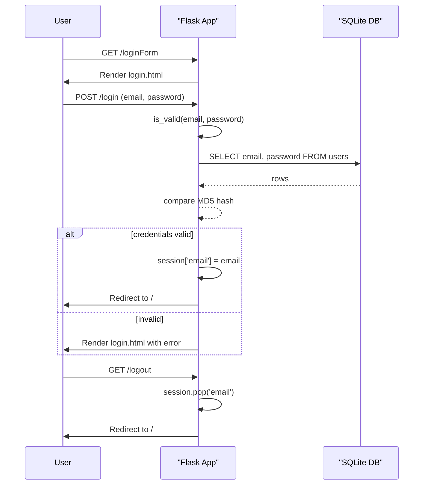

# User Login/Logout

## Overview
The User Login/Logout feature enables customers to authenticate with the e‑commerce site, access their personal profile, and terminate their session. It is used by any visitor who has previously registered an account (`users` table) and wishes to view or modify protected resources such as the shopping cart or profile pages.

## Behavior
Step‑by‑step execution of the login and logout flows (citations use `path:line`).

1. **Show login form** – A GET request to `/loginForm` invokes `loginForm()` (`main.py:63`).  
   *If the user is already authenticated (`'email' in session`), they are redirected to the home page; otherwise the `login.html` template is rendered.*

2. **Submit credentials** – The login form posts to `/login` which calls `login()` (`main.py:85`).  
   *The function extracts `email` and `password` from `request.form`.*

3. **Validate credentials** – `login()` calls `is_valid(email, password)` (`main.py:211`).  
   *`is_valid` opens a DB connection, fetches all rows from `users` (`SELECT email, password FROM users`) (`main.py:213`), hashes the supplied password with MD5, and returns `True` if a matching row is found (`main.py:217‑221`).*

4. **Create session** – If `is_valid` returns `True`, `login()` stores the email in the Flask session (`session['email'] = email`) (`main.py:88`) and redirects to the home page (`url_for('root')`).  
   *If validation fails, the login page is re‑rendered with an error message (`main.py:92`).*

5. **Logout** – A GET request to `/logout` triggers `logout()` (`main.py:205`).  
   *The function removes the email from the session (`session.pop('email', None)`) (`main.py:206`) and redirects to the home page.*

## Triggers
| Route | Method(s) | Function | Purpose |
|-------|-----------|----------|---------|
| `/loginForm` | GET | `loginForm` (`main.py:63`) | Display the login page |
| `/login` | POST (also accepts GET but only processes POST) | `login` (`main.py:85`) | Process login credentials |
| `/logout` | GET | `logout` (`main.py:205`) | End the user session |

## Flow Diagram

## State & Storage
| Entity | Operation | SQL / Code | Location |
|--------|-----------|------------|----------|
| `users` table | **Read** – fetch all `email`/`password` pairs for validation | `SELECT email, password FROM users` (`main.py:213`) | `is_valid` |
| Session | **Write** – store logged‑in email | `session['email'] = email` (`main.py:88`) | `login` |
| Session | **Read** – check login status (e.g., in `getLoginDetails`) | `if 'email' not in session` (`main.py:42`) | `getLoginDetails` |
| Session | **Write** – remove email on logout | `session.pop('email', None)` (`main.py:206`) | `logout` |

No other tables are modified by the login/logout feature.

## External Dependencies
* **Flask** – request handling, session management (`from flask import *`).
* **hashlib** – MD5 hashing of passwords (`hashlib.md5`).
* **SQLite3** – database access (`sqlite3` module).

No external APIs or third‑party services are called.

## Configuration
* **`app.secret_key`** – hard‑coded as `'random string'` (`main.py:12`). This key secures Flask sessions.
* **Password hashing** – MD5 is used directly in the code (`hashlib.md5`) – not configurable.

## Edge Cases & Concerns
| Issue | Description | Impact |
|-------|-------------|--------|
| **Weak password hashing** – MD5 is cryptographically broken and fast, making brute‑force attacks feasible. | Passwords stored as `MD5(password)` (`main.py:215`, `main.py:239`). | Confidentiality risk. |
| **Plain‑text password transmission** – Login form posts password over HTTP unless the site is served via HTTPS. | No explicit enforcement of HTTPS. | Man‑in‑the‑middle exposure. |
| **Session fixation / CSRF** – Logout is a simple GET request; an attacker could trigger it via a forged link. | No CSRF token validation on `/logout`. | Potential denial‑of‑service for the user. |
| **Inefficient credential check** – `is_valid` loads *all* users into memory and iterates in Python. | `SELECT email, password FROM users` then loop (`main.py:214‑221`). | Performance degradation with many users. |
| **Missing rate limiting / account lockout** – Repeated failed logins are not throttled. | No logic to count attempts. | Vulnerable to credential stuffing/brute force. |
| **Hard‑coded secret key** – Using a static string reduces session security. | `app.secret_key = 'random string'` (`main.py:12`). | Predictable session signatures. |
| **Login route accepts GET** – Although only POST is processed, the route is declared with both methods, potentially exposing the form via URL parameters. | `@app.route("/login", methods = ['POST', 'GET'])` (`main.py:85`). | Minor confusion; not a functional bug. |
| **No email uniqueness enforcement** – The `users` table does not declare `email` as UNIQUE, allowing duplicate accounts. | Table definition in `database.py` (`CREATE TABLE users ...`). | Ambiguous login behavior. |

## Open Questions
1. **Session backend** – The code relies on Flask’s default cookie‑based session. In a multi‑instance deployment, is a server‑side session store (e.g., Redis) planned?  
2. **Password policy** – Are there any front‑end or back‑end checks for password strength during registration? The source does not show any.  
3. **Account activation** – Is there any email verification step not shown in the provided code?  
4. **Logout CSRF protection** – Would the team consider converting `/logout` to a POST endpoint with CSRF tokens?  
5. **Future migration to a stronger hash** – Is there a roadmap to replace MD5 with `bcrypt`/`argon2`?  

---  
*All line references follow the `path:line` format as requested.*