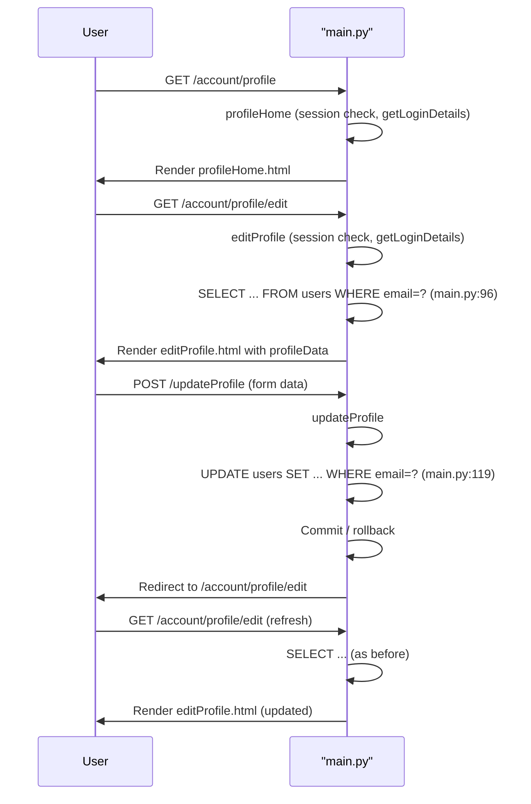

# User Profile Management

## Overview
The User Profile Management feature lets a logged‑in user view, edit, and update their personal profile information (name, address, contact details, etc.). It is used by any registered user who has an active session (`session['email']`).

## Behavior
Step‑by‑step execution:

1. **View profile home** – The user navigates to `/account/profile`.  
   *`profileHome`* is called (`main.py:78`). It checks that `'email'` exists in the session, obtains the login summary via `getLoginDetails` (`main.py:13‑22`), and renders `profileHome.html`.

2. **Open edit form** – From the profile home page the user clicks “Edit”.  
   The request goes to `/account/profile/edit`.  
   *`editProfile`* runs (`main.py:86`). It again checks the session, calls `getLoginDetails`, then queries the **users** table for the full record of the logged‑in email:  

   ```sql
   SELECT userId, email, firstName, lastName, address1, address2,
          zipcode, city, state, country, phone
   FROM users
   WHERE email = ?               -- main.py:96
   ```  

   The result (`profileData`) is passed to `editProfile.html`.

3. **Submit updates** – The user modifies fields and submits the form, which posts to `/updateProfile`.  
   *`updateProfile`* processes the POST (`main.py:112`). It extracts all form fields and executes an UPDATE on the **users** table:  

   ```sql
   UPDATE users
   SET firstName = ?, lastName = ?, address1 = ?, address2 = ?,
       zipcode = ?, city = ?, state = ?, country = ?, phone = ?
   WHERE email = ?                -- main.py:119
   ```  

   On success it commits, sets `msg = "Saved Successfully"` (or rolls back on error), closes the connection, and redirects back to the edit page (`url_for('editProfile')`).

4. **Result** – After the redirect the user sees the refreshed edit form with the updated data.

## Triggers
| Route | HTTP Method | Function | Purpose |
|-------|-------------|----------|---------|
| `/account/profile` | GET | `profileHome` (`main.py:78`) | Show profile home page |
| `/account/profile/edit` | GET | `editProfile` (`main.py:86`) | Load edit form with current data |
| `/updateProfile` | POST (also accepts GET but only POST is used) | `updateProfile` (`main.py:112`) | Persist edited profile fields |

## Flow Diagram


## State & Storage
| Operation | Table | Columns read | Columns written | Source line |
|-----------|-------|--------------|----------------|-------------|
| `getLoginDetails` (login summary) | `users` | `userId`, `firstName` | – | `main.py:17` |
| `getLoginDetails` (cart count) | `kart` | `count(productId)` | – | `main.py:20` |
| `editProfile` query | `users` | all profile columns (`userId`, `email`, `firstName`, `lastName`, `address1`, `address2`, `zipcode`, `city`, `state`, `country`, `phone`) | – | `main.py:96` |
| `updateProfile` UPDATE | `users` | `email` (WHERE) | `firstName`, `lastName`, `address1`, `address2`, `zipcode`, `city`, `state`, `country`, `phone` | `main.py:119` |
| Password validation (outside this feature) | `users` | `email`, `password` | – | `main.py:170` |

## External Dependencies
* **Flask** – web framework (`from flask import *`).  
* **sqlite3** – embedded relational database.  
* **hashlib** – used elsewhere for MD5 hashing of passwords.  
* **werkzeug.utils.secure_filename** – used for file uploads (not directly in profile management).  
No external APIs or third‑party services are called.

## Configuration
* `app.secret_key = 'random string'` – hard‑coded secret used for session signing (`main.py:6`).  
* `UPLOAD_FOLDER = 'static/uploads'` and `ALLOWED_EXTENSIONS` – defined but not used by profile routes (`main.py:7‑9`).  
* No environment variables are consulted.

## Edge Cases & Concerns
| Issue | Description | Location |
|-------|-------------|----------|
| **Weak password storage** | Passwords are stored as plain MD5 hashes, which are fast to crack and lack salting. | `main.py:136` (registration) and `main.py:170` (validation) |
| **Missing input validation** | `updateProfile` writes whatever is submitted without length, format, or SQL‑injection safeguards (parameterised queries are used, but no sanitisation of email format, phone number, etc.). | `main.py:112‑124` |
| **No CSRF protection** | Forms are processed without CSRF tokens, exposing the endpoints to cross‑site request forgery. | All POST routes (`/updateProfile`, `/addItem`, etc.) |
| **Hard‑coded secret key** | Using a static string for `app.secret_key` is insecure for production. | `main.py:6` |
| **Redirect after update** | After a successful update the user is redirected to the edit page, not the profile home, which may be confusing. | `main.py:124` |
| **Potential race condition** | Two concurrent updates could overwrite each other; no optimistic locking is implemented. | `main.py:119` |
| **Email as identifier** | The UPDATE uses `WHERE email = ?`; if the email field were editable (it isn’t in the form) it could cause mismatches. | `main.py:119` |
| **No feedback on success** | The redirect discards the success message (`msg = "Saved Successfully"` is never displayed). | `main.py:119‑124` |

## Open Questions
* **Session handling** – How long does the session persist? Is there a timeout or renewal mechanism? (Only `session['email']` is used; no explicit expiry logic is visible.)  
* **User‑experience flow** – Should the user be taken back to the profile home after a successful update rather than the edit page?  
* **Email uniqueness enforcement** – The registration route inserts a new user without checking for duplicate emails; does the database schema define a UNIQUE constraint on `email`? (Not shown in `database.py`.)  
* **Internationalisation** – Are address fields validated for different country formats? No validation logic is present.  
* **Audit trail** – Is there any logging of profile changes for compliance? The current code does not log updates.