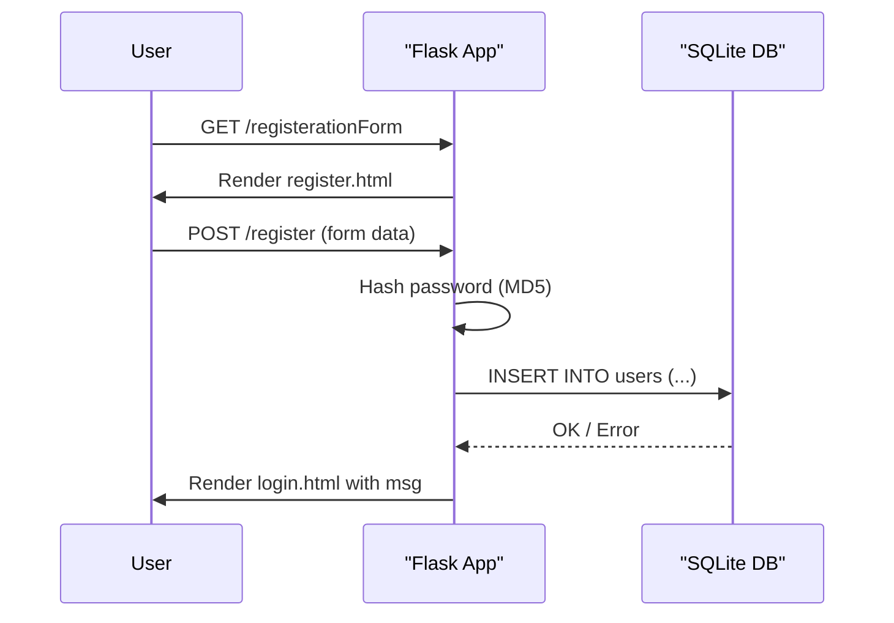

# User Registration

## Overview
The **User Registration** feature lets new visitors create an account on the e‑commerce site. It is used by anyone who does not already have a login and wants to become a registered shopper.

## Behavior
Step‑by‑step execution when a user registers:

1. **Display registration form** – The user navigates to `/registerationForm` (`main.py:85`).  
2. **Submit form** – The form posts to `/register` (`main.py:86`).  
3. **Parse request data** – The handler extracts `password`, `email`, `firstName`, `lastName`, `address1`, `address2`, `zipcode`, `city`, `state`, `country`, `phone` (`main.py:88‑99`).  
4. **Hash password** – The plain‑text password is transformed with MD5: `hashlib.md5(password.encode()).hexdigest()` (`main.py:90`).  
5. **Insert into DB** – A new row is added to the `users` table with the SQL statement  

   ```sql
   INSERT INTO users (password, email, firstName, lastName, address1, address2,
                     zipcode, city, state, country, phone)
   VALUES (?, ?, ?, ?, ?, ?, ?, ?, ?, ?, ?)
   ```  

   executed at `main.py:92`.  
6. **Commit / rollback** – On success the transaction is committed and a success message is stored in `msg`; on any exception the transaction is rolled back and an error message is set (`main.py:95‑99`).  
7. **Render login page** – The user is shown `login.html` with the message (`main.py:101`).

## Triggers
* **Route** `GET /registerationForm` – renders `templates/register.html`.  
* **Route** `POST /register` – processes the submitted registration data.  
* The HTML form in `templates/register.html` posts to `/register`.

## Flow Diagram


## State & Storage
| Operation | Table | Columns written/read | Source |
|-----------|-------|----------------------|--------|
| Insert new user | `users` | `password`, `email`, `firstName`, `lastName`, `address1`, `address2`, `zipcode`, `city`, `state`, `country`, `phone` | `main.py:92` |
| (No explicit reads in this flow) | – | – | – |

## External Dependencies
* **Flask** – web framework (`import * from flask` in `main.py:1`).  
* **sqlite3** – embedded relational DB (`import sqlite3` in `main.py:1`).  
* **hashlib** – provides MD5 hashing (`import hashlib` in `main.py:1`).  
* **werkzeug.utils.secure_filename** – used elsewhere for file uploads (`from werkzeug.utils import secure_filename` in `main.py:1`).  

## Configuration
| Setting | Value / Description | Source |
|---------|---------------------|--------|
| `app.secret_key` | `'random string'` – used for session signing | `main.py:7` |
| `UPLOAD_FOLDER` | `'static/uploads'` – location for uploaded files | `main.py:8` |
| `ALLOWED_EXTENSIONS` | `{'jpeg','jpg','png','gif'}` – allowed image types | `main.py:9` |
| `app.config['UPLOAD_FOLDER']` | Mirrors `UPLOAD_FOLDER` | `main.py:10` |

## Edge Cases & Concerns
* **Password security** – MD5 is considered weak; a stronger algorithm (e.g., bcrypt, Argon2) should be used.  
* **Input validation** – No server‑side validation for email format, required fields, or length limits; malformed data could be inserted.  
* **Error handling** – Generic `except:` blocks swallow exceptions, making debugging difficult and potentially exposing ambiguous messages to users.  
* **Duplicate accounts** – No check for existing email addresses before insertion, leading to possible `UNIQUE` constraint violations (if a unique index were added later).  
* **SQL injection protection** – Parameterized queries are used, which is good, but the lack of validation still leaves room for logical errors.  
* **Session fixation** – The secret key is hard‑coded; rotating it or loading from an environment variable would be safer.

## Open Questions
* **Email uniqueness** – The `users` table does not define a UNIQUE constraint on `email`; is duplicate registration allowed by design?  
* **Post‑registration flow** – After successful registration the user is sent to the login page; is there any email verification step not shown in the code?  
* **Deployment environment** – How is the SQLite file (`database.db`) provisioned and persisted across deployments?  
* **Password policy** – Are there any password strength requirements enforced elsewhere (e.g., client‑side JavaScript) that are not visible in the server code?